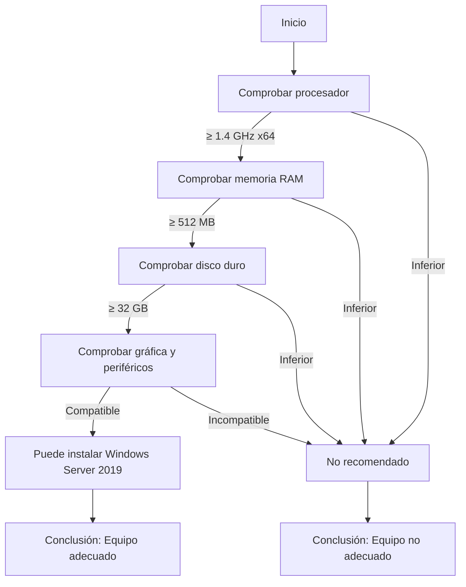

# Actividad 1 – Microsoft Windows Server 2019

## Comprobación del hardware

**Objetivo:** Analizar si es posible instalar **Microsoft Windows Server 2019** en mi equipo teniendo en cuenta los requisitos mínimos recomendados.

**Requisitos mínimos recomendados:**

| Componente        | Requisito                                   |
|--------------------|---------------------------------------------|
| Procesador         | Al menos 1,4 GHz (procesador x64)           |
| Memoria RAM        | Al menos 512 MB                             |
| Disco duro         | Al menos 32 GB                              |
| Salida estándar    | Al menos Super VGA (1024 x 768)             |
| Otros              | Teclado y ratón compatibles con Microsoft   |

---

## Ejecución del Windows PowerShell
Resultado de código
Archivo fiel generado.

## Justificacón
Mi equipo "Marta" cumple ampliamente con los requisitos mínimos de Microsoft Windows Server 2019:

El procesador Intel Core i5-4590 (3.30 GHz) es mucho más potente que el mínimo necesario (1.4 GHz x64).

Dispone de 16 GB de RAM, cuando el requisito mínimo es de 512 MB.

El almacenamiento es un SSD de 932 GB, mucho más rápido y con gran capacidad.

Y mi tarjeta gráfica Intel HD Graphics 4590 y los periféricos son totalmente compatibles con Microsoft.
(Aunque igualmente mi dispositivo va lento pero por otros problemas que tiene)
