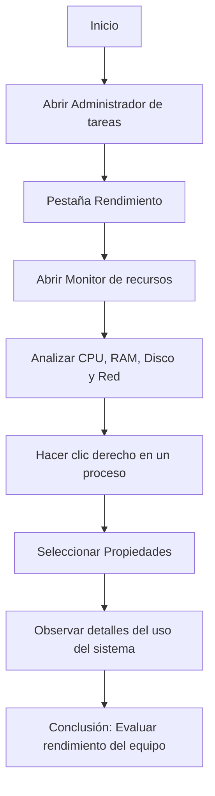

# Actividad 2 – Microsoft Windows Server 2019

## Monitor de recursos

**Objetivo:**  
Trabajar con la herramienta **Monitor de recursos** para analizar en tiempo real el uso del **procesador**, la **memoria RAM**, el **disco duro** y la **red**, utilizando los gráficos del sistema para evaluar el estado actual del equipo.

---

### Pasos para acceder al Monitor de recursos

1. Abre el **Administrador de tareas**:
   - Pulsa **Ctrl + Shift + Esc** o haz clic derecho en la barra de tareas y selecciona **Administrador de tareas**.
2. Dirígete a la pestaña **Rendimiento**.
3. Haz clic en el botón **“Abrir monitor de recursos”** (abajo de la ventana).
4. Una vez abierto, explora las siguientes pestañas:
   - **CPU:** muestra los procesos y su consumo de procesador.
   - **Memoria:** visualiza la cantidad de RAM usada y disponible.
   - **Disco:** indica la lectura y escritura del disco en tiempo real.
   - **Red:** muestra las conexiones activas y su uso.

5. **botón derecho** sobre cualquiera de los procesos listados y **Propiedades** para más información.

---

### Diagrama de flujo – Uso del Monitor de recursos


## Pasos para abrir y usar el Monitor de rendimiento
1. Haz clic en el botón Inicio de Windows.
2. Escribe Monitor de rendimiento y ábrelo.
   También puedes acceder desde:
   Inicio → Herramientas administrativas → Monitor de rendimiento.
3. En el panel izquierdo, selecciona Monitor de rendimiento.
4. Para agregar un contador:
   Haz clic en el botón verde (+).
   En la lista, selecciona Disco físico → Bytes de lectura por segundo y Bytes de escritura por segundo.
   Pulsa Agregar → Aceptar.
5. Si lo deseas, elimina contadores con el botón rojo (X).
6. Haz doble clic en los contadores añadidos para ajustar la duración del análisis a 15 minutos.
7. Observa los gráficos y analiza los resultados obtenidos.
#DIagrama de flujo - Analisis del rendimiento
```mermaid
flowchart TD
    A[Inicio] --> B[Abrir Monitor de rendimiento]
    B --> C[Seleccionar Monitor de rendimiento en el panel izquierdo]
    C --> D[Agregar contador de lectura/escritura de disco]
    D --> E[Ajustar duración del análisis a 15 minutos]
    E --> F[Observar gráficos y datos en tiempo real]
    F --> G[Analizar rendimiento del sistema]
    G --> H[Conclusión: Evaluar si el equipo funciona adecuadamente]
