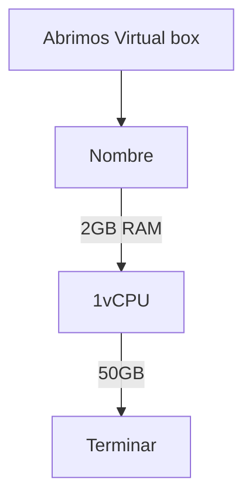

# Actividades de Aplicación

# 2.21.
Modifica los colores de la consola de PowerShell, el título de la ventana y el prompt. Añade los cambios al fichero del perfil de usuario

# 2.22.
Instala sobre el software de virtualización que estés usando, y donde tengas instalado el servidor, una máquina virtual donde se instale el sistema operativo Windows 10. Llama a esa máquina virtual Cliente1.
Crear máquina nueva → Windows 10.

Nombre: Cliente1.
Asignar:
2 GB RAM minimo
1 vCPU
50 GB de disco
Montar ISO de Windows 10
Instalar sistema.
# 2.23.
Comprueba la conexión entre las máquinas Cliente1 y Servidor utilizando el comando ping y Test-NetConnection.
Ponemos ipconfig para saber la IP y luego hacemos ping para comprobar conectividad

# 2.24.
Crea un usuario local llamado usuariolocal. Haz que sea un usuario estándar y créale una contraseña que él no pueda cambiar. Entra como usuariolocal e intenta cambiarla.
# 2.25.
En un sistema Windows Server 2019 con Active Directory instalado muestra el nombre del equipo y el de su dominio. Añade el ordenador Cliente1 al dominio del servidor.
# 2.26.
En un sistema Windows Server 2019 con Active Directory crea una nueva unidad organizativa llamada departamento que contenga un usuario, usuario1, y un equipo, Cliente1, que ya existan previamente. Si no existen, créalos.
# 2.27.
Restringe el acceso al dominio del usuario usuario1 solo desde el equipo Cliente1.
# 2.28.
Crea un usuario global, usuario2, en Active Directory. Comprueba que puede iniciar sesión en Active Directory desde Cliente1.
# 2.29.
Modifica usuario2 de forma que no pueda modificar su contraseña y que la contraseña nunca caduque.
# 2.30.
Crea un usuario global, usuario3, en el Active Directory a partir del usuario usuario2 de la actividad anterior.
# 2.31.
Crear un grupo global, grupo1, en Active Directory.
# 2.32.
Agrega el usuario usuario3 al grupo grupo1.
# 2.33.
Mueve usuario3 a la unidad organizativa departamento que creaste en la Actividad de aplicación 2.26.
# 2.34.
Elimina el usuario usuario3.
# 2.35.
Elimina el grupo grupo1.
# 2.36.
Instala sobre el software de virtualización donde tengas instalado el servidor una máquina virtual donde se instale el sistema operativo Windows 10 usando WDS. Llama a esa máquina virtual Cliente2.
# 2.37.
Configura la red en las máquinas virtuales Cliente1 y Cliente2, de manera que obtengas la dirección IP en ambas mediante DHCP.
# 2.38.
Comprueba la conexión entre las máquinas Cliente1 y Servidor y Cliente2 y Servidor, utilizando el comando ping o el comando Test-NetConnection.
# 2.39.
Añade Cliente2 al dominio y a la unidad organizativa departamento.
# 2.40.
Comprueba mediante PowerShell si tienes instalado el rol de servidor Servicios de impresión y documentos. Si no es así, instálalo mediante PowerShell. Comprueba que está correctamente instalado y su funcionamiento. Si es posible, agrega una impresora a tu servidor.
# 2.41.
Añade un usuario, usuario4, y configúralo para que acceda a los recursos del dominio, utilizando solo Cliente1, de lunes a viernes, de 9:00 a 12:00 AM.
# 2.42.
Crea una variable de entorno llamada Minombre y cuyo contenido sea tu nombre completo. Añade el directorio C:\temp a la variable Path. Muestra el valor de las variables
# 2.43.
Con el comando diskpart lista los discos que tienes en el sistema. Hazlo también con comandos de PowerShell.
# 2.44.
Con el comando diskpart lista los volúmenes y las particiones que tienes en el disco. Hazlo también con comandos de PowerShell.
# 2.45.
Abre la consola del sistema y en Archivo → Agregar o quitar complemento… crea una consola personalizada con las vistas de Administrador de dispositivos y Administración de equipos.
# 2.46.
Renueva la dirección IP de tu equipo.
# 2.47.
Comprueba la dirección IP de tu equipo. Hazlo utilizando el comando ipconfig, el cmdlet Get-NetIpAddress y desde el Panel de Control. Después comprueba el funcionamiento de tu interfaz de red utilizando el comando ping y el cmdlet Test-NetConnection con la dirección IP 127.0.0.1 o localhost.
# 2.48.
En el dominio, crea dos usuarios, usu1 y usu2, e inicia sesión con ambos desde el equipo del dominio Cliente1.
# 2.49.
Realiza cambios en el entorno de trabajo de los dos usuarios creando un fichero en el escritorio, y otro en la carpeta Documentos: fichero1.txt y fichero2.txt, respectivamente.
# 2.50.
Cierra la sesión y explora sus carpetas de perfil con la cuenta del administrador local de Cliente1. También revisa la carpeta Usuarios del controlador de dominio y mira allí si se crearon perfiles de usuario.
# 2.51.
Intenta iniciar sesión en el servidor usando usu1. ¿Qué mensaje recibes? ¿Qué puedes hacer para que usu1 pueda iniciar sesión en el controlador de dominio?
